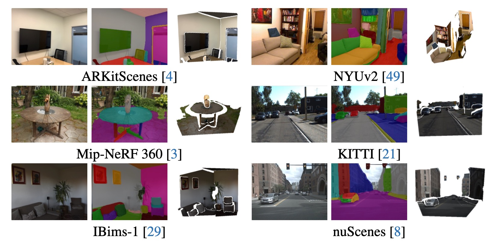

# ZeroPlane
Official Implementation of **ZeroPlane** Towards In-the-wild 3D Plane Reconstruction from a Single Image (CVPR 2025 Highlight)

<a href="https://arxiv.org/pdf/2506.02493"></a> <a href="https://github.com/jcliu0428/ZeroPlane"></a> <a href=""></a>


## 📖 Overview

We present ZeroPlane, an end-to-end transformer-based framework on single-image 3D plane reconstruction and segmentation. Our model achieves state-of-the-art plane recovery quality across multiple indoor and outdoor dataset, especially on in-the-wild images. Besides, we construct a large-scale high-quality, high-resolution dataset across multiple benchmarks captured from various environments for future research on generalizable 3D plane reconstruction task.

## 🔨 Environment Installation
### 1. Git clone

```bash
git clone https://github.com/jcliu0428/ZeroPlane
```
### 2. Create a conda environment and install dependencies

```bash
# create conda and install all packages
conda env create -f environment.yml
conda activate zeroplane

# install pytorch under your GPU cuda version
pip3 install torch==2.1.0 torchvision==0.16.0 torchaudio==2.1.0 --index-url https://download.pytorch.org/whl/cu121

# install detectron2
python3 -m pip install 'git+https://github.com/facebookresearch/detectron2.git'

# compile MSDeformAttn
cd ZeroPlane/modeling/pixel_decoder/ops
sh make.sh
```

### 3. Download pretrained checkpoints

```bash
# download full-model checkpoint stored on huggingface
mkdir checkpoints && cd checkpoints
wget https://huggingface.co/jcleo0428/ZeroPlane-Dust3R/resolve/main/dust3r_encoder_released.pth
```

## 🔥 Getting Started
For a quick demo to infer our plane reconstruction on a specified image, please refer to this script:

```bash
python demo/demo.py \
    --config-file configs/ZeroPlaneNYUV2/dust3r_large_dpt_bs16_50ep.yaml \
    --input ./demo/cvpr_demo.png \ # test image
    --out ./demo/demo_out \ # save planar depth, segmentation and mesh by default
    --resize_w 640 \ # image width and height before feeding into the model
    --resize_h 480 \
    --opts \
    MODEL.WEIGHTS ./checkpoints/dust3r_encoder_released.pth # please change the checkpoint directory if you would like to try other versions
```

## 🔗 Download datasets
```bash
# evaluation datasets
# Note: please modify the root_path in ZeroPlane/data/datasets/register_your_dataset.py if you would like to place the data in your specified directory.
mkdir datasets && cd datasets
wget https://huggingface.co/datasets/jcleo0428/ZeroPlane_dataset/resolve/main/nyuv2_plane.zip
wget https://huggingface.co/datasets/jcleo0428/ZeroPlane_dataset/resolve/main/parallel_domain_plane.zip
wget https://huggingface.co/datasets/jcleo0428/ZeroPlane_dataset/resolve/main/sevenscenes_plane.zip
wget https://huggingface.co/datasets/jcleo0428/ZeroPlane_dataset/resolve/main/apollo_stereo_plane.zip

unzip nyuv2_plane.zip
unzip parallel_domain_plane.zip
unzip sevenscenes_plane.zip
unzip apollo_stereo_plane.zip
```

## 📜 Evalution script
```bash
# evaluation on NYU-v2 testing set.
python train_net.py \
    --eval-only \
    --num-gpus 1 \
    --config-file configs/ZeroPlaneNYUV2/dust3r_large_dpt_bs16_50ep.yaml \
    MODEL.WEIGHTS ./checkpoints/dust3r_encoder_released.pth \
    OUTPUT_DIR ./visualizations/nyuv2_test_vis \
    INPUT.LARGE_RESOLUTION_INPUT "False" \ # whether to apply large-res input
    INPUT.LARGE_RESOLUTION_EVAL "False" \ # whether to apply large-res evaluation
    TEST.NO_VIS "True" # whether to save visualizations to OUTPUT_DIR
```

## ✨ Training script
```bash
# training with dinov2 encoder
export CUDA_VISIBLE_DEVICES=0,1
python train_net.py \
    --num-gpus 2 \
    --config-file configs/ZeroPlaneMixed/dinov2/dinov2_base_bs16_50ep.yaml \ # dinov2 training
    --dist-url 'tcp://127.0.0.1:64750' \ # tcp
    OUTPUT_DIR checkpoints/dinov2_base_train_low_res \ # output dir
    INPUT.LARGE_RESOLUTION_INPUT "False" \ # whether to use large-res training
    INPUT.DINO_INPUT_HEIGHT 196 \ # input height
    INPUT.DINO_INPUT_WIDTH 252 \ # input width
    SOLVER.IMS_PER_BATCH 16 \ # total batch size
    SOLVER.MAX_ITER 50000 \ # total iterations
    SOLVER.STEPS '(40000, 47000)' \ # scheduler
    SOLVER.CHECKPOINT_PERIOD 5000 \ # ckpt saving freq
    TEST.EVAL_PERIOD 50001 \

# training with dust3r encoder
export CUDA_VISIBLE_DEVICES=0,1
python train_net.py \
    --num-gpus 2 \
    --config-file configs/ZeroPlaneMixed/dust3r_large_dpt_bs16_50ep.yaml \ # dust3r training
    --dist-url 'tcp://127.0.0.1:64750' \ # tcp
    OUTPUT_DIR checkpoints/dust3r_train_low_res \ # output dir
    INPUT.LARGE_RESOLUTION_INPUT "False" \ # whether to use large-res training
    INPUT.DINO_INPUT_HEIGHT 196 \ # input height
    INPUT.DINO_INPUT_WIDTH 252 \ # input width
    SOLVER.IMS_PER_BATCH 16 \ # total batch size
    SOLVER.MAX_ITER 50000 \ # total iterations
    SOLVER.STEPS '(40000, 47000)' \ # scheduler
    SOLVER.CHECKPOINT_PERIOD 5000 \ # ckpt saving freq
    TEST.EVAL_PERIOD 50001 \
```

## 🚀 Release Plan
* [x] Github created **[2025.03.24]**
* [x] Demo & evaluation code and pretrained model release. **[2025.06.12]**
* [x] Evaluation dataset release.
* [ ] Training dataset release.
* [x] Training code release. 
* [ ] Gradio demo.


## 📜 Reference
If you find this project useful or insightful, please consider citing:
```
@inproceedings{liu2025towards,
  title={Towards In-the-wild 3D Plane Reconstruction from a Single Image},
  author={Liu, Jiachen and Yu, Rui and Chen, Sili and Huang, Sharon X and Guo, Hengkai},
  booktitle={Proceedings of the Computer Vision and Pattern Recognition Conference},
  pages={27027--27037},
  year={2025}
}
```


## 🙏 Acknowledgement
ZeroPlane is built based on a couple of outstanding open-sourced projects. We truly appreciate their great work and well-organized codebase, which provide tremendous support and inspiration during the process of our implementation:

- [PlaneRecTR](https://github.com/graphdeco-inria/gaussian-splatting)
- [Mask2Former](https://github.com/facebookresearch/Mask2Former)
- [Depth Anything](https://depth-anything.github.io/)
- [Dust3R](https://github.com/naver/dust3r)
- [DPT](https://github.com/isl-org/DPT)
